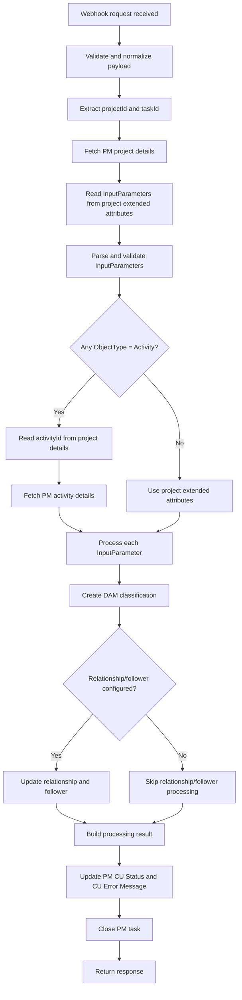

# Low Level Design - PM Classification Webhook API

## 1. Document Information

| Field | Value |
|---|---|
| Document Name | Low Level Design - PM Classification Webhook API |
| Application | PM Classification Webhook Utility |
| Module | PM Classification Webhook API |
| Technology | Node.js, TypeScript, Express |
| Source System | Aprimo PM / Kong |
| Target Systems | Aprimo PM API, Aprimo DAM API |
| Document Type | Low Level Design |

---

## 2. API Overview

The PM Classification Webhook API receives webhook events from Aprimo PM through Kong and processes classification creation in Aprimo DAM.

The API validates and normalizes the webhook payload, extracts project and task identifiers, fetches required PM project and activity details, reads `InputParameters`, creates classifications in DAM, processes relationship/follower mappings, updates PM project status fields, and closes the related PM task.

| Item | Details |
|---|---|
| API Name | PM Classification Webhook API |
| HTTP Method | `POST` |
| Endpoint | `/api/v1/webhook/create-classification` |
| Content-Type | `application/json` |
| Response Type | `application/json` |
| Caller | Aprimo PM through Kong |
| Main Trigger | `PM_CLASSIFICATION_CREATE` |
| Authentication | Managed through Kong/API gateway where applicable |

---

## 3. API Contract and Validation

### 3.1 API Contract

| Contract Item | Details |
|---|---|
| Request Format | JSON webhook payload from Aprimo PM/Kong |
| Response Format | JSON |
| Main Identifier | `projectId` |
| Task Identifier | `taskId` from webhook `ObjectId` |
| Processing Status | `SUCCESS`, `PARTIAL_SUCCESS`, `FAILED` |
| Final Task Action | Close PM task after status update attempt |

### 3.2 Validation Rules

| Validation | Required Behavior |
|---|---|
| `environment` is missing | Reject request or mark failure where possible. |
| `projectId` is missing | Stop processing because PM project details cannot be fetched. |
| `taskId` is missing | Continue processing if possible, skip task close and log clearly. |
| `InputParameters` is missing | Mark PM project as FAIL and close task if task id is available. |
| `InputParameters` is invalid JSON | Mark PM project as FAIL and close task if task id is available. |
| `ObjectType` is missing | Default to `Project` for backward compatibility. |
| `ObjectType` is not `Project` or `Activity` | Fail validation with a clear error message. |
| `ObjectType = Activity` but `activityId` is missing | Mark PM project as FAIL and close task if task id is available. |
| DAM parent classification path is missing | Fail classification creation for that input parameter. |
| Relationship field is missing when relationship is enabled | Fail relationship processing for that mapping. |

---

## 4. Request Payload Design

### 4.1 Expected Request Fields

| Field | Type | Required | Description |
|---|---|---|---|
| `ObjectId` | `string` / `number` | Yes for task close | PM task id from Aprimo webhook. |
| `Body` | `object` / `string` | Yes | Contains project details such as `project_id` or `projectId`. |
| `Environment` | `string` | Yes | Target environment. |

### 4.2 Payload Handling Rule

The webhook `Body` may arrive as either a JSON object or a string. The controller must normalize both formats and extract the same `projectId` value.

Example object body:

```json
{
  "Body": {
    "project_id": 271114,
    "step_type": 9,
    "status": "Approved"
  }
}
```

Example string body:

```json
{
  "Body": "{project_id: 271114, step_type: 9, status: 'Approved', test_mode: 1}"
}
```

### 4.3 Normalized Request Model

```ts
export interface CuNodeWebhookRequest {
  environment: string;
  triggerType: string;
  projectId: string | number;
  taskId?: string | number;
  eventId?: string;
  eventTime?: string;
  objectResourceName?: string;
}
```

### 4.4 Identifier Mapping

| Source Field | Internal Field | Notes |
|---|---|---|
| `Body.project_id` | `projectId` | Primary PM project id source. |
| `ObjectId` | `taskId` | PM task id used for closing the task. |
| `Environment` | `environment` | Target environment. |

---

## 5. Response Design

### 5.1 Success Response

```json
{
  "message": "PM classification webhook processed successfully",
  "environment": "qa",
  "triggerType": "PM_CLASSIFICATION_CREATE",
  "projectId": 271114,
  "status": "SUCCESS",
  "warnings": []
}
```

### 5.2 Partial Success Response

```json
{
  "message": "PM classification webhook completed with warnings",
  "environment": "qa",
  "triggerType": "PM_CLASSIFICATION_CREATE",
  "projectId": 271114,
  "status": "PARTIAL_SUCCESS",
  "warnings": [
    "Relationship/follower processing failed."
  ]
}
```

### 5.3 Failure Response

```json
{
  "message": "PM classification webhook processing failed",
  "environment": "qa",
  "triggerType": "PM_CLASSIFICATION_CREATE",
  "projectId": 271114,
  "status": "FAILED",
  "warnings": []
}
```

---

## 6. Component Design

| File/Class | Responsibility |
|---|---|
| `CuNodeWebhookController` | Receives webhook request, validates and normalizes payload, calls dispatcher/service, updates PM status, closes PM task, and returns response. |
| `WebhookDispatcherService` | Routes webhook processing to the correct service based on trigger type. |
| `PmClassificationWebhookService` | Main orchestration service for PM classification processing. |
| `PmProjectService` | Fetches PM project details from Aprimo PM API. |
| `PmActivityService` | Fetches PM activity details from Aprimo PM API when `ObjectType = Activity`. |
| `DamClassificationService` | Creates DAM classifications and processes relationship/follower updates. |
| `PmProjectStatusService` | Updates PM project `CU Status` and `CU Error Message`. |
| `PmTaskService` | Closes PM task after status update. |
| `inputParameterParser` | Parses and validates `InputParameters`. |
| `httpRetry` | Provides reusable retry logic for selected external API operations. |
| `aprimoErrorLogger` | Logs sanitized Aprimo API errors. |
| `httpClient` | Common HTTP client for outbound Aprimo API calls. |
| `env.ts` | Reads and validates environment configuration. |

---

## 7. Detailed Processing Flow



### 7.1 Controller-Level Flow

1. Receive webhook request.
2. Validate and normalize payload.
3. Extract `projectId` from `Body.project_id`.
4. Extract `taskId` from `ObjectId`.
5. Call dispatcher/service for processing.
6. Update PM status based on processing result.
7. Close PM task after status update attempt.
8. Return response to caller.

### 7.2 Service-Level Flow

1. Fetch project details from Aprimo PM.
2. Read `InputParameters` from project extended attributes.
3. Parse and validate input parameters.
4. Identify whether activity details are required.
5. Fetch activity details only when at least one input parameter has `ObjectType = Activity`.
6. Resolve classification name from project or activity extended attributes.
7. Create DAM classification.
8. Process relationship and follower mappings where configured.
9. Return final processing status with warnings if any.

---

## 8. InputParameter and Attribute Resolution

### 8.1 InputParameters Source

`InputParameters` is read from PM project extended attributes. It controls how DAM classifications are created and how relationship/follower processing should be handled.

### 8.2 InputParameter Model

```ts
export type ClassificationObjectType = 'Project' | 'Activity';

export interface NormalizedInputParameter {
  extAttrId: string | number;
  objectType: ClassificationObjectType;
  parentNamePath: string;
  establishRelationship?: boolean;
  relationshipField?: string;
  addToFollowers?: boolean;
  leaderExtAttr?: string | number;
}
```

### 8.3 ObjectType Rules

| ObjectType | Source of Classification Value |
|---|---|
| `Project` | PM project extended attributes. |
| `Activity` | PM activity extended attributes. |
| Missing | Default to `Project`. |
| Any other value | Invalid configuration; fail processing. |

### 8.4 Project Attribute Resolution

When `ObjectType = Project`, the service reads the classification value from `projectDetails.extendedAttributes` using `ExtAttrID`.

```text
classificationName = value from projectDetails.extendedAttributes where eaId = ExtAttrID
```

### 8.5 Activity Attribute Resolution

When `ObjectType = Activity`, the service reads `activityId` from PM project details, then calls the activity details API and reads the classification value from `activityDetails.extendedAttributes`.

```text
activityId = projectDetails.activityId
classificationName = value from activityDetails.extendedAttributes where eaId = ExtAttrID
```

### 8.6 Example InputParameters

```json
[
  {
    "ExtAttrID": "36601",
    "ObjectType": "Project",
    "ParentNamePath": "Root/Business Unit",
    "EstablishRelationship": false,
    "AddToFollowers": false
  },
  {
    "ExtAttrID": "36602",
    "ObjectType": "Activity",
    "ParentNamePath": "Root/Campaign",
    "EstablishRelationship": true,
    "RelationshipField": "Related Classification",
    "AddToFollowers": true,
    "LeaderExtAttr": "36601"
  }
]
```

---

## 9. DAM Classification, Relationship and Follower Processing

### 9.1 Classification Creation Flow

1. Read parent classification path from `InputParameter`.
2. Validate classification value from PM project/activity extended attribute.
3. Fetch or validate parent classification from DAM if required.
4. Create DAM classification under configured parent path.
5. Store created classification id and input parameter mapping.

### 9.2 Created Classification Tracking

The service should track created classifications because relationship and follower processing may need leader and follower classification ids.

```ts
export interface CreatedClassification {
  inputParameterExtAttrId: string | number;
  classificationId: string | number;
  classificationName: string;
  parentNamePath: string;
}
```

### 9.3 Relationship Processing

Relationship processing is performed when `establishRelationship = true`.

Expected behavior:

1. Find follower classification created for the current input parameter.
2. Find leader classification using `leaderExtAttr`.
3. Validate relationship field.
4. Update relationship field on follower classification.

### 9.4 Follower Processing

Follower processing is performed when `addToFollowers = true`.

Expected behavior:

1. Find leader classification.
2. Find follower classification.
3. Update leader classification `followerClassifications`.

### 9.5 Partial Success Handling

If classification creation succeeds but relationship/follower processing fails, the API may return `PARTIAL_SUCCESS` with warning details based on current processing logic.

---

## 10. PM Status and Task Close Design

### 10.1 Final Status Rule

The PM task must be closed in all processing conditions after status update is attempted.

```text
Status update should happen before task close.
Task close should happen for SUCCESS, PARTIAL_SUCCESS and FAILED conditions.
```

### 10.2 Status Mapping

| Processing Result | CU Status | CU Error Message | Close Task |
|---|---|---|---|
| `SUCCESS` | `PASS` | Blank/Cleared | Yes |
| `PARTIAL_SUCCESS` | `FAIL` | Warning/error message | Yes |
| `FAILED` | `FAIL` | Actual error message | Yes |

### 10.3 Controller-Level Status Flow

1. Process webhook.
2. Receive processing result.
3. If result is `SUCCESS`, call `markPass()`.
4. If result is `PARTIAL_SUCCESS`, call `markFail()` with warning message.
5. If result is `FAILED` or exception occurs, call `markFail()` with error message.
6. After status update attempt, call `closeTask()`.
7. Return final response or pass error to centralized error handler.

### 10.4 Failure During Status Update

If PM status update fails, the error must be logged clearly with `projectId`, `taskId`, `environment`, and sanitized error details.

The task close behavior should follow the confirmed business rule: task close should still be attempted after status update attempt in all conditions.

---

## 11. External API Calls

### 11.1 Aprimo PM APIs

| API | Method | Purpose |
|---|---|---|
| `/api/projects/{projectId}` | `GET` | Fetch PM project details. |
| `/api/activities/{activityId}` | `GET` | Fetch PM activity details. |
| `/api/projects/{projectId}` | `PUT` / `PATCH` | Update project extended attributes for `CU Status` and `CU Error Message`. |
| `/api/tasks/{taskId}/close` | `POST` | Close PM task. |

### 11.2 Aprimo DAM APIs

| API | Method | Purpose |
|---|---|---|
| `/api/core/classification` | `POST` | Create DAM classification. |
| `/api/core/classification/{classificationId}` | `PUT` | Update relationship field or follower classifications. |
| DAM field/classification lookup APIs | `GET` | Fetch required parent classification or field details. |

### 11.3 Common Headers

| Header | Purpose |
|---|---|
| `Authorization` | Bearer token for Aprimo APIs. |
| `API-VERSION` | Aprimo API version header. |
| `Content-Type` | Request body format. |
| `Accept` | Expected response format. |

---

## 12. Error Handling and Retry Design

### 12.1 Error Handling Principles

- Use centralized error handling.
- Throw or propagate proper `Error` objects.
- Do not expose internal stack traces or sensitive details to API consumers.
- Log sanitized Aprimo API errors.
- Keep error messages clear enough for support and testing teams.

### 12.2 Error Scenarios

| Scenario | Expected Behavior |
|---|---|
| Missing `projectId` | Stop processing and return safe failure response. |
| Missing `environment` | Stop processing and return safe failure response. |
| Missing `taskId` | Continue processing if possible, skip task close, log warning. |
| Project details API failure | Mark PM project FAIL if project id is available, close task if task id is available. |
| `InputParameters` missing/invalid | Mark PM project FAIL, close task if task id is available. |
| Activity id missing | Mark PM project FAIL, close task if task id is available. |
| Activity details API failure | Mark PM project FAIL, close task if task id is available. |
| DAM classification creation failure | Mark PM project FAIL, close task if task id is available. |
| Relationship/follower failure | Return `PARTIAL_SUCCESS` or `FAILED` based on processing result; update PM status accordingly. |
| PM status update failure | Log error with context. |
| PM task close failure | Log error with context. |

### 12.3 Retry Scope

Retry should be applied only for selected DAM linking operations:

- DAM relationship field update.
- DAM follower classification update.

Retry should not be applied globally to every external API call.

### 12.4 Reason for Retry

DAM classification creation may succeed, but the newly created classification may not be immediately ready for relationship/follower updates. This can cause temporary failures during linking operations.

### 12.5 Retryable Conditions

| Condition | Retry? | Notes |
|---|---|---|
| Network/transient HTTP error | Yes | Use common retry utility. |
| HTTP 5xx | Yes | Transient server-side failure. |
| HTTP 429 | Yes | Rate limit or throttling. |
| HTTP 400 for selected DAM linking APIs | Yes | Only for relationship/follower update due to Aprimo readiness delay. |
| HTTP 400 globally | No | Usually validation issue. |

### 12.6 Retry Configuration

| Setting | Value |
|---|---|
| Retry attempts | `3` |
| Delay increment | `5000 ms` |
| Scope | Relationship/follower update only |

---

## 13. Logging and Monitoring Design

### 13.1 Logging Requirements

The API should use structured logs for production troubleshooting.

Important log fields:

- `environment`
- `projectId`
- `taskId`
- `eventId`
- `triggerType`
- `classificationId`
- `inputParameterExtAttrId`
- `objectType`
- `processingStatus`
- `warningCount`

### 13.2 Logging Points

| Step | Log Level | Purpose |
|---|---|---|
| Webhook received | `info` | Confirm request reached API. |
| Payload normalized | `info` | Confirm `projectId`/`taskId` resolved. |
| Project details fetch started/completed | `info` | Trace PM project API call. |
| `InputParameters` resolved | `info` | Confirm configuration found. |
| Activity details fetch started/completed | `info` | Trace activity API call when required. |
| Classification creation started/completed | `info` | Trace DAM classification creation. |
| Relationship/follower retry | `warn` | Show retry attempt and delay. |
| Relationship/follower failure | `error` | Capture linking failure. |
| PM status update started/completed | `info` | Confirm PASS/FAIL update. |
| PM task close started/completed | `info` | Confirm task close. |
| Unexpected error | `error` | Capture sanitized failure details. |

### 13.3 Sensitive Data Logging Rule

Do not log:

- `client_secret`
- `client_id`
- `access_token`
- `Authorization` header
- Passwords
- Full sensitive payload data

Sensitive values should be masked before logging.

---

## 14. Configuration and Security Design

### 14.1 Configuration Variables

Expected configuration should be externalized using environment variables or approved secret management.

| Variable | Purpose | Secret? |
|---|---|---|
| `APRIMO_PM_BASE_URL` | Aprimo PM base URL. | No |
| `APRIMO_DAM_BASE_URL` | Aprimo DAM base URL. | No |
| `APRIMO_TOKEN_URL` | Aprimo token endpoint. | No |
| `APRIMO_CLIENT_ID` | Aprimo OAuth client id. | Yes |
| `APRIMO_CLIENT_SECRET` | Aprimo OAuth client secret. | Yes |
| `APRIMO_CLASSIFICATION_LANGUAGE_ID` | DAM classification language id. | No |
| `CU_STATUS_EA_ID` | PM CU Status extended attribute id. | No |
| `CU_STATUS_PASS_VALUE` | PASS value for CU Status. | No |
| `CU_STATUS_FAIL_VALUE` | FAIL value for CU Status. | No |
| `CU_ERROR_MESSAGE_EA_ID` | PM CU Error Message extended attribute id. | No |


---

## 15. File-Level Implementation Checklist

| Area | Expected Implementation |
|---|---|
| Controller | Keep request validation, normalization, response handling, and final status/task close orchestration. |
| Dispatcher | Route supported webhook trigger types to the correct processing service. |
| Service | Keep business processing and orchestration. |
| PM clients/services | Keep PM project, activity, status, and task close API calls separate. |
| DAM service | Keep classification creation and relationship/follower processing separate. |
| Retry utility | Keep reusable retry logic outside service classes. |
| Parser utility | Keep `InputParameters` parsing and `ObjectType` validation separate. |
| Logger utility | Keep error sanitization and structured logging reusable. |
| Config | Keep environment variables centralized and validated. |
| Tests | Cover success, validation, partial success, failure, retry, and logging-sensitive paths. |
| Documentation | Keep API endpoint, configuration, and processing behavior updated when implementation changes. |

