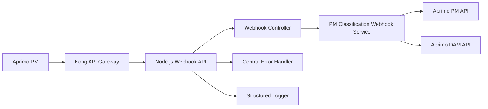
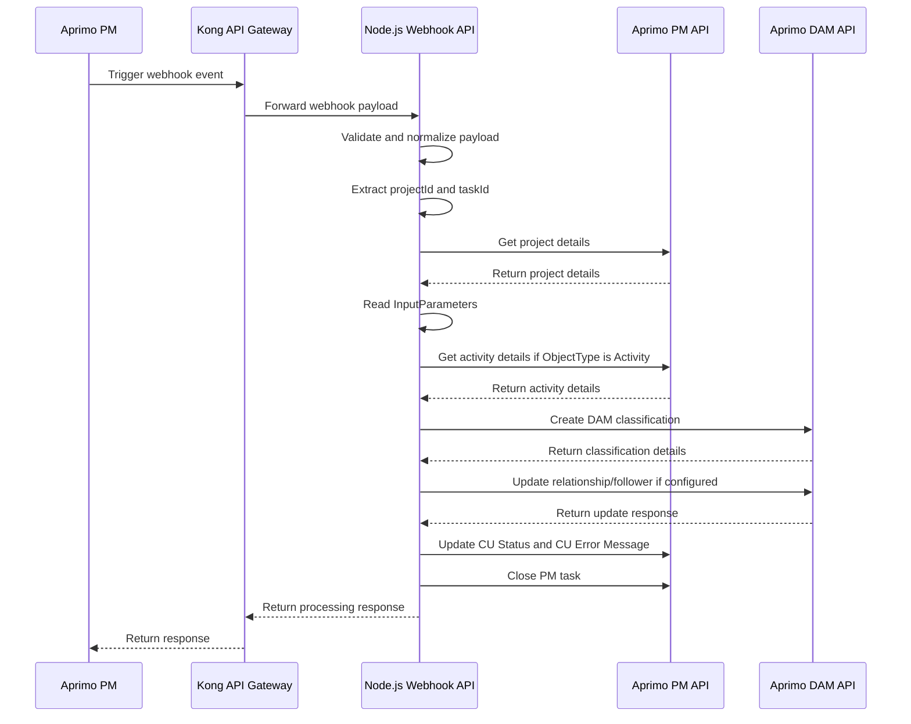

# High Level Design - PM Classification Webhook API

## 1. Document Information

| Field | Value |
|---|---|
| Document Name | High Level Design - PM Classification Webhook API |
| Application | PM Classification Webhook Utility |
| Technology | Node.js, TypeScript, Express |
| Source System | Aprimo PM / Kong |
| Target Systems | Aprimo PM API, Aprimo DAM API |
| Document Type | High Level Design |
| Version | 1.0 |
| Status | Draft |

## 2. Purpose

The purpose of this API is to receive webhook events from Aprimo PM through Kong, process PM project classification input parameters, create or update required classifications in Aprimo DAM, update the processing status back to Aprimo PM, and close the related PM task.

This API helps automate classification creation and relationship/follower processing based on project or activity extended attribute values.

## 3. Business Requirement

When a PM workflow event is triggered, the system should automatically process classification-related configuration from the PM project, create the required DAM classifications, establish classification relationships if configured, add follower classifications if configured, update PM project status fields, and close the PM task.

The process should support both:

- ObjectType = Project
- ObjectType = Activity

For Project, the classification value is read from project extended attributes.

For Activity, the classification value is read from activity extended attributes.

## 4. Scope

### In Scope

1. Receive webhook request from Aprimo PM/Kong
2. Validate and normalize webhook payload
3. Extract projectId and taskId
4. Fetch PM project details
5. Read InputParameters from project extended attributes
6. Fetch activity details when ObjectType is Activity
7. Create DAM classifications
8. Process classification relationships
9. Add follower classifications
10. Update CU Status and CU Error Message in PM
11. Close PM task after processing
12. Log important processing steps and errors

### Out of Scope

1. UI changes in Aprimo PM or DAM
2. Manual classification creation
3. DAM field configuration changes
4. Kong route creation details
5. User management or role management
6. Manual retry from UI

## 5. Systems Involved

| System | Responsibility |
|---|---|
| Aprimo PM | Triggers webhook, stores project/task/activity data |
| Kong API Gateway | Routes webhook request to Node.js API |
| Node.js Webhook API | Validates payload, controls process flow, calls PM/DAM APIs |
| Aprimo PM API | Provides project/activity details, updates status fields, closes task |
| Aprimo DAM API | Creates classifications, updates relationships, adds followers |
| Logging/Monitoring | Captures execution details, warnings and failures |

## 6. High-Level Architecture

## 7. High-Level Process Flow

1. Aprimo PM sends webhook event through Kong.
2. Kong forwards the request to Node.js Webhook API.
3. API validates and normalizes the webhook payload.
4. API extracts projectId and taskId.
5. API fetches project details from Aprimo PM.
6. API reads InputParameters from project extended attributes.
7. API checks each InputParameter ObjectType.
8. If ObjectType is Project, value is read from project extended attributes.
9. If ObjectType is Activity, API fetches activity details and reads value from activity extended attributes.
10. API creates required classification in Aprimo DAM.
11. API processes relationship field if configured.
12. API adds follower classification if configured.
13. API updates PM project CU Status and CU Error Message.
14. API closes the PM task.
15. API returns final response to caller.

## 8. Sequence Diagram

## 9. API Overview

| Item | Details |
|---|---|
| API Name | PM Classification Webhook API |
| Method | POST |
| Endpoint | `/api/v1/webhook/pm-classification` |
| Request Source | Aprimo PM through Kong |
| Response Format | JSON |
| Authentication | Managed through Kong/API security configuration where applicable |
| Main Processing Service | `PmClassificationWebhookService` |

Note: If the actual route name is different in code, update the endpoint value before publishing.

## 10. Main Request Fields

| Field | Purpose |
|---|---|
| `ObjectId` | PM task id from Aprimo webhook |
| `Body.project_id` / `Body.projectId` | PM project id |
| `Environment` / environment field | Target environment |
| `ObjectResourceName` | Source object information |
| `EventId` | Webhook event identifier |
| `EventTime` | Webhook event timestamp |

The webhook body may be received as a JSON object or as a string. The API normalizes the payload before processing.

## 11. InputParameters Design

The API reads InputParameters from PM project extended attributes. This configuration controls how classifications should be created.

Each input parameter can contain:

| Field | Purpose |
|---|---|
| `ExtAttrID` | Source extended attribute id |
| `ObjectType` | Defines whether value should be read from Project or Activity |
| `ParentNamePath` | DAM parent classification path |
| `EstablishRelationship` | Indicates whether relationship should be created |
| `RelationshipField` | DAM relationship field name/id |
| `AddToFollowers` | Indicates whether follower classification should be added |
| `LeaderExtAttr` | Leader extended attribute reference |

Supported ObjectType values:

- Project
- Activity

If ObjectType is missing, the API treats it as Project for backward compatibility.

## 12. Component Responsibilities

| Component | Responsibility |
|---|---|
| Webhook Controller | Receives request, validates payload, sends response |
| Webhook Service | Coordinates PM/DAM processing |
| PM Project Service | Fetches PM project details |
| PM Activity Service | Fetches PM activity details when required |
| DAM Classification Service | Creates classifications and updates DAM relationship/follower data |
| PM Project Status Service | Updates CU Status and CU Error Message |
| PM Task Service | Closes PM task |
| Token Service | Handles Aprimo access token generation/caching |
| HTTP Client | Common API client for external calls |
| Logger | Captures structured logs |
| Error Handler | Handles API errors consistently |

## 13. Status Handling

The API updates PM project status before closing the PM task.

| Processing Result | CU Status | CU Error Message | Task Close |
|---|---|---|---|
| Success | PASS | Blank/Cleared | Yes |
| Partial Success | FAIL | Warning/error message | Yes |
| Failure | FAIL | Actual error message | Yes |

Important rule: CU Status and CU Error Message should be updated before closing the PM task.

## 14. Error Handling Design

The API follows centralized error handling.

Expected error scenarios:

1. Missing projectId
2. Missing or invalid InputParameters
3. PM project details API failure
4. Activity details API failure
5. DAM classification creation failure
6. Relationship/follower update failure
7. PM status update failure
8. PM task close failure
9. Token generation failure
10. Invalid environment configuration

The API should not expose sensitive internal error details to the caller. Internal details should be captured only in secure logs.

## 15. Retry Design

Some DAM relationship or follower update calls may fail temporarily because the classification may not be immediately ready after creation.

To handle this, retry is applied only for selected DAM linking operations:

1. DAM relationship field update
2. DAM follower classification update

Retry should not be applied globally for every API call.

This avoids unnecessary retries for validation errors while still handling temporary Aprimo readiness issues.

## 16. Logging and Monitoring

The API uses structured logging for traceability.

Important logging points:

1. Webhook request received
2. projectId and taskId resolved
3. Project details fetched
4. InputParameters resolved
5. Activity details fetched if required
6. Classification creation started/completed
7. Relationship processing started/completed
8. Follower processing started/completed
9. CU Status and CU Error update started/completed
10. PM task close started/completed
11. Error/warning captured

Logs should include safe identifiers such as:

- projectId
- taskId
- environment
- eventId
- triggerType
- classificationId
- processingStatus

Logs should not include:

- client_secret
- access_token
- Authorization header
- password
- sensitive payload data

## 17. Security Considerations

1. API should be exposed through Kong Gateway.
2. Authentication and authorization should be controlled at gateway level where applicable.
3. Aprimo client id, client secret and tokens should not be hardcoded.
4. Secrets should be stored in environment variables or approved secret management.
5. Request payload should be validated before processing.
6. Sensitive values should be masked in logs.
7. Internal stack traces should not be exposed to API consumers.
8. Environment-specific configuration should remain externalized.

## 18. Deployment and Configuration

The API should support multiple environments using externalized configuration.

Expected environments:

- development
- qa
- production

Configuration should include:

- Aprimo PM base URL
- Aprimo DAM base URL
- Client ID
- Client Secret
- Token URL
- Classification language id
- CU Status extended attribute id
- CU Status PASS value
- CU Status FAIL value
- CU Error Message extended attribute id

No secrets should be committed into source code.

## 19. Assumptions

1. Kong will forward the webhook request to the correct Node.js API endpoint.
2. Webhook payload will contain project id either in body.projectId, body.project_id or Body string.
3. ObjectId from webhook represents PM task id.
4. InputParameters will be configured on the PM project.
5. Required extended attributes will exist in PM project or activity.
6. DAM parent classification path will already exist.
7. Aprimo PM and DAM APIs will be available during processing.

## 20. Risks and Mitigation

| Risk | Impact | Mitigation |
|---|---|---|
| Missing projectId | Processing cannot continue | Validate payload and mark failure where possible |
| Missing InputParameters | Classification cannot be created | Log clear error and update CU Error Message |
| Activity id missing for Activity ObjectType | Activity attributes cannot be read | Fail with clear error message |
| DAM classification not immediately ready | Relationship/follower update may fail | Retry selected DAM linking operations |
| Wrong environment config | API may call wrong Aprimo environment | Use environment-specific config and review before deployment |
| Secrets logged accidentally | Security issue | Mask sensitive fields in logs |
| Task closed before status update | PM status may remain blank | Always update status before closing task |

## 21. Non-Functional Requirements

1. API should follow Node.js/TypeScript coding standards.
2. API should use structured logging.
3. API should handle errors centrally.
4. API should avoid logging secrets.
5. API should be reusable and maintainable.
6. API should have unit test coverage for success, partial success and failure flows.
7. API should follow SonarQube quality expectations.
8. API should externalize environment-specific configuration.

## 22. Open Points

| Item | Status |
|---|---|
| Final Kong route URL | To be confirmed |
| Final PM/DAM environment URLs | To be confirmed |
| Final extended attribute ids | To be confirmed |
| Final task close behavior in all scenarios | Confirmed as close after status update |
| Final retry count and delay | To be confirmed |
| Monitoring dashboard/alerting | To be confirmed |

## 23. Summary

The PM Classification Webhook API automates classification creation and relationship/follower processing in Aprimo DAM based on PM project or activity data. The API receives webhook events through Kong, fetches required PM details, creates classifications in DAM, updates PM project status, and closes the PM task.

The design keeps gateway concerns in Kong, business orchestration in the Node.js service layer, Aprimo communication in dedicated services, and error/logging logic centralized for maintainability and production support.
